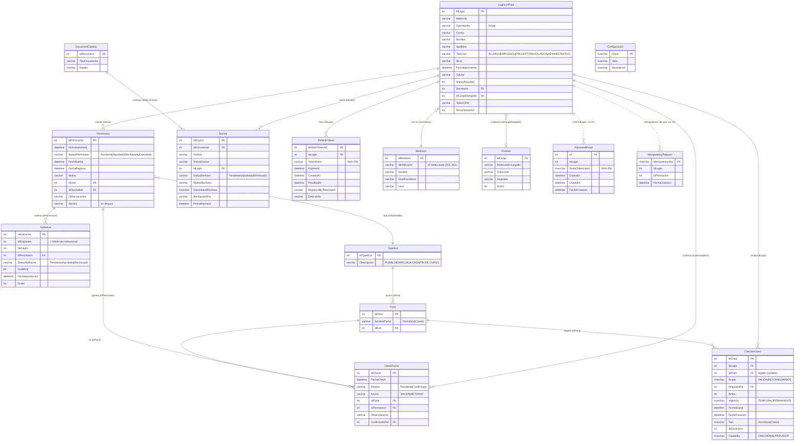

# UniPass API — Diagrama de base de datos

Modelo de datos real de la BD **`UNIPASS`** (SQL Server): **15 tablas, 15 foreign keys**.
Las tablas viven en el **esquema `UNIPASS`** → se referencian como **`UNIPASS.<Tabla>`**
(ej. `UNIPASS.LoginUniPass`). La tabla de usuarios es **`LoginUniPass`** (fuente de verdad).
Ver también [03-arquitectura.md](03-arquitectura.md) y [ENDPOINTS.md](ENDPOINTS.md).

**Scripts SQL** (`database/schema/`):
- `UNIPASS_full_schema.sql` — creación desde cero: BD + esquema `UNIPASS` + 15 tablas con
  constraints, índices, descripciones (MS_Description) y **datos semilla** (catálogos).
- `UNIPASS_migrate_dbo_to_schema.sql` — para una BD existente en `dbo`: mueve las tablas al
  esquema `UNIPASS` con `ALTER SCHEMA TRANSFER` **sin perder datos**.

## Diagrama entidad-relación (Mermaid)

> Se renderiza en GitHub, VS Code (Markdown Preview Mermaid) y mermaid.live.

## Foreign keys (15, reales)

| Tabla.columna | → Referencia | Relación |
|---|---|---|
| `Authorize.IdPermission` | `Permission.IdPermission` | eslabones de la cadena |
| `CheckerGrant.IdLogin` | `LoginUniPass.IdLogin` | beneficiario del grant |
| `CheckerGrant.AsignadoPor` | `LoginUniPass.IdLogin` | quién otorgó |
| `CheckerGrant.IdPoint` | `Point.IdPoint` | legado (modelo por punto) |
| `CheckPoints.IdPoint` | `Point.IdPoint` | punto del check |
| `CheckPoints.IdPermission` | `Permission.IdPermission` | los 4 checks del permiso |
| `CheckPoints.ConfirmadoPor` | `LoginUniPass.IdLogin` | checador que confirmó |
| `Doctos.IdDocumento` | `DocumentCatalog.IdDocument` | tipo de documento |
| `Doctos.IdLogin` | `LoginUniPass.IdLogin` | dueño del documento |
| `LoginUniPass.Dormitorio` | `Bedroom.IdBedroom` | dormitorio del usuario |
| `LoginUniPass.IdCargoDelegado` | `Position.IdCargo` | suplencia activa |
| `Permission.IdUser` | `LoginUniPass.IdLogin` | alumno solicitante |
| `Permission.IdTipoSalida` | `TypeExit.IdTypeExit` | tipo de salida |
| `Point.IdExit` | `TypeExit.IdTypeExit` | puntos por tipo de salida |
| `RefreshToken.IdLogin` | `LoginUniPass.IdLogin` | sesiones del usuario |

> **Relaciones lógicas SIN FK declarada:** `PasswordReset.IdLogin` e `IdempotencyRequest.IdLogin`
> apuntan a `LoginUniPass.IdLogin` por convención de aplicación (no hay constraint en BD; en el
> diagrama van con línea punteada `..`).

## Catálogo de tablas por dominio

**Identidad / sesión**
- **`LoginUniPass`** — usuarios (alumnos y empleados). `TipoUser`: ALUMNO, EMPLEADO, PRECEPTOR,
  VIGILANCIA, ADMINISTRATIVO (DEPARTAMENTO retirado). `Contraseña` = hash bcrypt.
- **`RefreshToken`** — sesiones: hash SHA-256, rotación (`ReplacedByTokenHash`), revocación (`RevokedAt`).
- **`PasswordReset`** — recuperación (Task 7.1.B): solo hash del reset token, expiración, single-use.

**Permisos y autorización**
- **`Permission`** — solicitud de salida. `IdTipoSalida` → `TypeExit`.
- **`TypeExit`** — catálogo de tipos: 1 PUEBLO, 2 ESPECIAL, 3 A CASA, 4 FIN DE CURSO.
- **`Authorize`** — cadena de aprobadores por permiso (`Orden`, `DualRole`). `IdEmpleado` = matrícula institucional.
- **`IdempotencyRequest`** — dedupe de `POST /permission` por `Idempotency-Key` (Task 7.4A).

**Checado**
- **`Point`** — puntos de control (`NombrePunto`: Dormitorio/Caseta) por tipo de salida (`IdExit`).
- **`CheckPoints`** — los 4 checks por permiso (`Accion` × punto); `ConfirmadoPor` = checador.
- **`CheckerGrant`** — capability asignable: `Capability` (CHECKER/SUPERVISOR), `Tipo`
  (Dormitorio/Caseta), `IdDormitorio`, `Scope`, `Vigencia`. `IdPoint` es legado. Unicidad
  `(IdLogin, Tipo, IdDormitorio)`.

**Dormitorios / cargos**
- **`Bedroom`** — dormitorios; `Identificador` es el id institucional usado por API-ULV (`prece/:id`).
- **`Position`** — suplencias entre empleados (mecanismo aparte de CheckerGrant).

**Documentos**
- **`DocumentCatalog`** — catálogo de tipos de documento.
- **`Doctos`** — documentos del expediente (`IdDocumento` = TIPO, compartido entre usuarios; el id
  único por documento es `IdDoctos`). Estados de revisión y datos de rechazo.

**Configuración**
- **`Configuracion`** — clave/valor operable con UPDATE (sin redeploy): `AUTORIZADOR_SALIDAS`,
  `COORDINADOR_IDEMPLEADO`, `COORDINADOR_NODEPTO`.

## Notas de integridad y convenciones

- **Fuente de verdad de usuarios:** `LoginUniPass` (no `db.sql`).
- **`Authorize.IdEmpleado` no es `IdLogin`**: es la **matrícula institucional**; se resuelve a
  `LoginUniPass.Matricula` cuando se necesita la cuenta local.
- **`CheckerGrant.IdPoint`** quedó como columna legado (el modelo vigente es por `Tipo`+`IdDormitorio`).
- **`Doctos.IdDocumento`** identifica el *tipo* de documento (se repite entre usuarios); para ownership
  por documento único usar `IdDoctos`.
- **Datos sensibles** en `LoginUniPass` (`Contraseña`, `TokenCFM`, `Correo`): saneados en los listados
  (checks/permisos/buscarPersona); pendientes en `GET /user/:Id`, `/userMatricula` y el `user` de `/login`.
